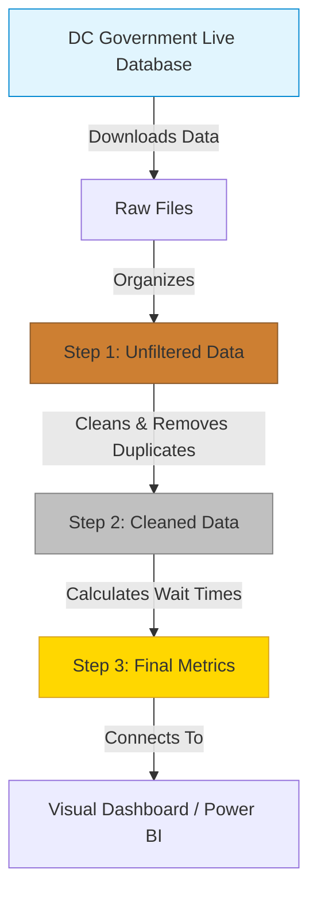

# DistrictPulse: DC 311 Service Analytics Platform

[](#architecture)
[](#how-it-works-under-the-hood)
[](https://opendata.dc.gov/)

**One-line pitch:** A data project that pulls live 311 service requests from the DC government to uncover whether some neighborhoods have to wait longer than others for basic city services.

---

## 📊 Executive Summary

The goal of this project goes beyond simply counting how many potholes were reported. Instead, it asks a critical question about fairness and operations: **Do residents in certain areas of the city wait significantly longer for the same services?**

By analyzing millions of real 311 records directly from the city, the data reveals significant differences in how fast the city responds depending on where you live.

### Key Findings (2022–2025)

> **1. The Neighborhood Gap**
> For high-demand services like **Bulk Trash Collection**, there is a massive difference in response times. Residents in **Ward 7** and **Ward 8** wait a median of **12.5 days** and **12.2 days**, respectively. Meanwhile, residents in **Ward 6** wait only **8.0 days**. That means people in certain parts of the city are waiting 56% longer for the exact same service based purely on their zip code.

> **2. Widespread Missed Deadlines**
> Across all neighborhoods and all types of services, the city frequently struggles to meet its own internal goals. Approximately **30.8%** of all completed service requests missed their target deadline. 

> **3. Overall Wait Times**
> Looking at every single type of 311 request combined, **Ward 4** experiences the longest wait time overall at **6.1 days**, while **Ward 8** actually has the fastest overall closure rate at **1.75 days** (though this is heavily influenced by the fact that certain high-volume, quick-fix requests like parking enforcement happen frequently there).

### Recommendation for City Leaders
To make service delivery fairer across the city, operational resources (like sanitation trucks and repair crews) should be proactively shifted toward Wards 4, 7, and 8 specifically for heavy infrastructure and waste services. The goal should be to bring the median wait times in those neighborhoods down so they match the rest of the District.

---

## 🏗 How It Works (Under the Hood)

This isn't just a simple spreadsheet. This platform automatically downloads raw data directly from the **DC Government's live database** and cleans it up so it can be easily understood by visual tools like Power BI.



---

## 🚀 Setup & Run Instructions

For data professionals and engineers who want to reproduce this project on their own machine:

### 1. Install Required Tools
Set up your virtual environment and install the necessary software.
```bash
python3 -m venv .venv
source .venv/bin/activate
pip install requests pandas duckdb dbt-duckdb dbt-core
```

### 2. Download the Data
Run the ingestion script to securely download the messy, raw records for 2022–2025 into your project folder.
```bash
python ingest.py
```

### 3. Clean and Process the Data
Navigate into the data-cleaning folder (`dbt_project`). This step will magically turn the messy data into a pristine database (`dc_311.duckdb`) and automatically run quality checks to make sure the data is accurate.
```bash
cd dbt_project
dbt run --profiles-dir .
dbt test --profiles-dir .
```

### 4. Connect to Power BI
1. Open Power BI Desktop.
2. Make sure you have the **DuckDB ODBC driver** installed.
3. Connect to the `DistrictPulse/dc_311.duckdb` file.
4. Drag-and-drop the `mart_response_by_ward_servicetype` data to build your own maps and charts!

---

## 📖 Data Dictionary

For the data analysts reading this, here is how the final database is structured:

| Table Name | What It Does | Level of Detail |
|---|---|---|
| `fact_service_requests` | The main table holding all requests, locations, and the calculated wait times. | 1 row per Request |
| `dim_ward` | A list of all standardized DC wards. | 1 row per Ward |
| `dim_service_type` | A list mapping specific services to their broader categories. | 1 row per Service |
| `mart_sla_by_ward` | The final numbers: missed deadline rates and wait times for each ward. | 1 row per Ward |
| `mart_response_by_ward_servicetype` | The data powering the main dashboard heatmap. | 1 row per Ward + Service |

---
*Data generously provided by the [DC Open Data / Office of Unified Communications](https://opendata.dc.gov/). Licensed CC BY 4.0.*
