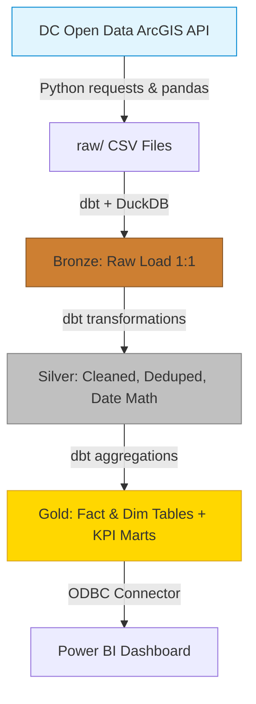

# DistrictPulse: DC 311 Service Analytics Platform

[](#architecture)
[](#ingestion-pipeline)
[](https://opendata.dc.gov/)

**One-line pitch:** An end-to-end analytics platform that ingests Washington DC's 311 service-request data from a live government API, models it in a layered SQL warehouse, and surfaces metrics exposing service-response disparities across city wards.

---

## 📊 Executive Brief

The purpose of this project is to go beyond simple volume counting and answer a critical operational and equity question: **Do residents in some wards wait significantly longer for the same city services than residents in others?**

Using a highly structured SQL warehouse built on millions of raw records, the data reveals significant variations in municipal service delivery speeds.

### Key Quantitative Findings (2022–2025)

> **1. The Response Equity Gap**
> For high-volume services like **Bulk Collection**, there is a massive disparity in resolution times. Residents in **Ward 7** and **Ward 8** wait a median of **12.5 days** and **12.2 days** respectively for bulk collection, while residents in **Ward 6** wait only **8.0 days**. That is a 56% longer wait time based purely on geographic location.

> **2. Widespread SLA Breaches**
> Across all wards and all service types, the city struggles to meet its own internal deadlines. Approximately **30.8%** of all closed service requests breach their assigned Service Level Agreement (SLA) due date. 

> **3. Overall Median Wait Times**
> Looking holistically across every service type combined, **Ward 4** experiences the longest median wait time at **6.1 days**, while **Ward 8** benefits from the fastest overall closure rate at **1.75 days** (heavily skewed by rapid closures of certain high-volume request types like parking enforcement).

### Recommendation
The city should deploy targeted operational resources (e.g., DPW trucks, DDOT crews) dynamically to Wards 4, 7, and 8 specifically for heavy infrastructure and waste services, aiming to equalize the median resolution times across the District.

---

## 🏗 Architecture & Stack

This project is not built on a static, downloaded Kaggle CSV. It pulls directly from the **DC Open Data ArcGIS REST API** and transforms the messy JSON into a pristine `dc_311.duckdb` database ready for enterprise BI tools like Power BI.



---

## 🚀 Setup & Run Instructions

To reproduce this pipeline on your local machine:

### 1. Install Dependencies
Set up your virtual environment and install the required data stack.
```bash
python3 -m venv .venv
source .venv/bin/activate
pip install requests pandas duckdb dbt-duckdb dbt-core
```

### 2. Ingest Live Data
Run the ingestion script. It will paginate through the DC ArcGIS API and download records for 2022–2025 into the `raw/` directory.
```bash
python ingest.py
```

### 3. Build the Data Warehouse
Navigate into the dbt project. `dbt run` will compile the raw CSVs into a structured DuckDB database, and `dbt test` will ensure data quality (checking for uniqueness, not-null constraints, and valid Ward values).
```bash
cd dbt_project
dbt run --profiles-dir .
dbt test --profiles-dir .
```

### 4. Connect to Power BI
1. Open Power BI Desktop.
2. Ensure you have the **DuckDB ODBC driver** installed.
3. Connect to the `DistrictPulse/dc_311.duckdb` file.
4. Drag-and-drop the `mart_response_by_ward_servicetype` into a Matrix visual to build the equity heatmap!

*(Alternatively, you can export the gold tables directly to CSV using the DuckDB CLI if you prefer flat files).*

---

## 📖 Data Dictionary (Gold Layer)

The dbt project culminates in several heavily optimized tables designed for immediate BI consumption:

| Table Name | Purpose | Grain |
|---|---|---|
| `fact_service_requests` | The core fact table containing all request times, locations, and pre-calculated `resolution_days` / `sla_breached` flags. | 1 row per Request ID |
| `dim_ward` | Dimension table of all standardized DC wards. | 1 row per Ward |
| `dim_service_type` | Dimension table mapping service types to their parent categories. | 1 row per Service Type |
| `mart_sla_by_ward` | Aggregated SLA breach rate, median resolution days, and backlog counts per ward. | 1 row per Ward |
| `mart_response_by_ward_servicetype` | Cross-tab matrix powering the core equity heatmap. | 1 row per Ward + Service Type |

---
*Data sourced from [DC Open Data / Office of Unified Communications](https://opendata.dc.gov/). Licensed CC BY 4.0.*
